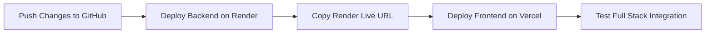

# 🚀 Deployment Guide: ScholarPulse AI

Complete step-by-step instructions for deploying the **FastAPI Backend on Render** and the **React + Vite Frontend on Vercel**.

---

## 📋 Recommended Deployment Sequence

> **Important**: Deploy the **Backend on Render first** so that you obtain your live backend URL (e.g. `https://scholarpulse-ai-backend.onrender.com`). You will then pass this URL as `VITE_API_BASE_URL` when configuring the frontend on Vercel.



---

## Step 1: Push Latest Changes to GitHub

Before deploying, ensure all cloud configuration files (`render.yaml`, `vercel.json`, CORS settings) are pushed to your GitHub repository:

```bash
git add .
git commit -m "chore: configure Render backend and Vercel frontend deployment"
git push origin main
```

---

## Step 2: Deploy Backend on Render

You can deploy using **Option A (Automated Blueprint)** or **Option B (Manual Web Service)**.

### Option A: Deploy via Blueprint (Easiest)

1. Log in to [Render](https://dashboard.render.com).
2. Click **New +** in the top navigation and choose **Blueprint**.
3. Select your GitHub repository: `0407SinghRajiv/ScholarPulse-AI`.
4. Render will automatically read the `render.yaml` file from the repository root.
5. In the configuration screen, enter your secret environment variable:
   - `GROQ_API_KEY`: Paste your Groq API key (`gsk_...`)
6. Click **Apply**.
7. Render will build and launch your service.

---

### Option B: Deploy Manually as a Web Service

If you prefer manual configuration without Blueprints:

1. In Render Dashboard, click **New +** -> **Web Service**.
2. Connect your GitHub repository: `ScholarPulse-AI`.
3. Configure the following fields:

| Field | Value |
|---|---|
| **Name** | `scholarpulse-ai-backend` (or your preferred name) |
| **Region** | Choose the closest region (e.g., Singapore, Frankfurt, Oregon) |
| **Branch** | `main` |
| **Root Directory** | `backend` |
| **Runtime** | `Python 3` |
| **Build Command** | `pip install -r requirements.txt` |
| **Start Command** | `uvicorn app.main:app --host 0.0.0.0 --port $PORT` |
| **Instance Type** | Free |

4. Scroll down to **Environment Variables** and add:

| Key | Value | Notes |
|---|---|---|
| `PYTHON_VERSION` | `3.11.9` | Ensures compatible Python runtime |
| `GROQ_API_KEY` | `gsk_...` | Your Groq API Key |
| `GROQ_MODEL` | `groq/compound-mini` | Or whichever Groq model you prefer |
| `CORS_ORIGINS` | `*` | Allows calls from any Vercel domain |

5. Under **Advanced Settings**, set **Health Check Path** to `/health`.
6. Click **Create Web Service**.

> ⏳ **Render Free Tier Note**: Free tier web services spin down after 15 minutes of inactivity. The first request after sleep may take ~30–50 seconds while the instance spins back up.

7. Once deployment finishes, copy your live backend URL (e.g. `https://scholarpulse-ai-backend.onrender.com`).
8. Verify it by visiting `https://<your-render-url>/health` in your browser. You should receive:
   ```json
   {"status":"ok","service":"ScholarPulse AI Backend"}
   ```

---

## Step 3: Deploy Frontend on Vercel

1. Log in to [Vercel](https://vercel.com).
2. Click **Add New...** -> **Project**.
3. Import your GitHub repository: `0407SinghRajiv/ScholarPulse-AI`.
4. In the **Configure Project** screen:

### ⚠️ Critical Setting: Root Directory
- Locate the **Root Directory** line.
- Click **Edit**.
- Select the `frontend` directory and click **Continue**.

### Build and Output Settings
- **Framework Preset**: `Vite` (automatically detected)
- **Build Command**: `npm run build` (default)
- **Output Directory**: `dist` (default)
- **Install Command**: `npm install` (default)

### Environment Variables
Expand the **Environment Variables** section and add the following:

| Key | Value | Description |
|---|---|---|
| `VITE_API_BASE_URL` | `https://scholarpulse-ai-backend.onrender.com` | Your live Render backend URL (no trailing slash) |
| `VITE_SUPABASE_URL` | `https://jzyhoezvlfrjfgaaaqix.supabase.co` | Your Supabase project URL |
| `VITE_SUPABASE_ANON_KEY` | `eyJhbGciOi...` | Your Supabase public anonymous key |

5. Click **Deploy**.
6. Vercel will run `vite build` and provide a production deployment URL (e.g. `https://scholarpulse-ai.vercel.app`).

---

## Step 4: Verification & Smoke Testing

1. Open your live Vercel URL in your browser.
2. Open Developer Tools (`F12` -> `Network` tab and `Console`).
3. Click **"Try Sample Demo Paper"** on the hero section:
   - The frontend will make a request to `https://<your-backend-url>/sample`.
   - The analysis dashboard should immediately populate with metrics, executive summaries, radar charts, and research gaps.
4. Upload a sample PDF paper:
   - Confirm upload progress indicator.
   - Confirm analysis and section synthesis complete successfully.
5. Test PDF export:
   - Click **"Export Full PDF"** in the top navigation and ensure the branded PDF summary downloads.

---

## 🛠️ Troubleshooting & FAQs

### 1. CORS Errors (`Access-Control-Allow-Origin`)
- Ensure `CORS_ORIGINS` on Render is set to `*` or includes your specific Vercel URL (`https://scholarpulse-ai.vercel.app`).
- The backend already has custom fallback middleware in `backend/app/main.py` guaranteeing CORS headers even on 500 error responses.

### 2. 404 on Page Reload on Vercel
- Handled automatically by `frontend/vercel.json` rewrites (`/(.*) -> /index.html`).

### 3. Backend Takes 30–50 Seconds to Respond on First Request
- This is normal behavior on Render's free tier due to automatic spin-down. For continuous uptime, you can upgrade the Render instance or set up a free uptime monitor (e.g., UptimeRobot) pinging `/health` every 10 minutes.
